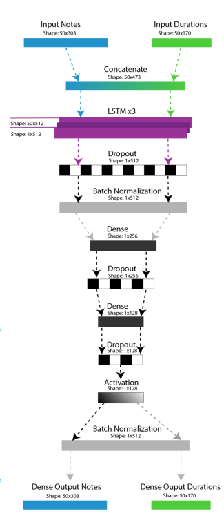

# Lo-Fi-music-Creating-using-LSTM
Generate lo-fi music with LSTMs in Python! Train an LSTM model on MIDI files to learn musical patterns. Then, feed the model a short starting sequence and it will predict note by note, creating a new lo-fi piece!
https://arxiv.org/pdf/1908.01080

# Data Preparation:

Collect Lo-fi Dataset: Gather a collection of lo-fi music pieces in MIDI format. This dataset will be used to train your LSTM model.
Preprocess Data:
Extract relevant information from MIDI files like note pitches, velocities (volume), and durations.
Quantize the data into a specific range (e.g., one-hot encoding for pitches).
Segment the data into sequences of fixed length, representing short musical phrases typical in lo-fi.
Model Building:

# Define LSTM Architecture:
Use Keras to create a sequential model.
Stack multiple LSTM layers to capture long-term dependencies in music sequences.
Consider adding Dropout layers between LSTMs to prevent overfitting.
Use Dense layers with a softmax activation at the output to predict the next element (e.g., next note) in the sequence.
Training:

# Compile the Model:

Specify an optimizer (e.g., RMSprop) suitable for LSTMs.
Set the loss function as categorical cross-entropy (multi-class classification) since you're predicting probabilities for the next element.
Train the Model:

Feed the preprocessed sequences into the model for training.
The model learns the patterns and relationships between notes, rhythms, and chords in lo-fi music.
Generation:

# Prepare Seed Sequence:

Create a short MIDI sequence (a few bars) representing the beginning of your desired lo-fi piece.
Preprocess this seed sequence similar to the training data.
Iterative Prediction:

Feed the seed sequence to the trained model.
The model predicts the next element (note) in the sequence.
Append the predicted element to the seed sequence.
Use the extended sequence as input for the next prediction.
Repeat this process for the desired length of your lo-fi piece.
Post-processing (Optional):

Apply techniques to enhance the generated music like:
Smoothing note transitions for a more natural feel.
Adjusting velocities for rhythmic variations.
Additional Considerations:

Experiment with different LSTM layer configurations and hyperparameters (number of layers, units per layer) to find the best fit for your dataset and desired musical style.
Explore incorporating additional information like drum patterns or chord progressions into the model for richer generation.

